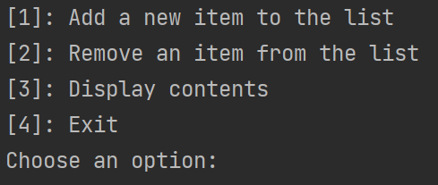
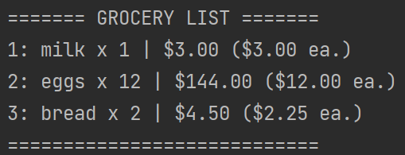

# Grocery List
---

## Part I: Basic Functionality
---
In order for your grocery list to be considered “complete” in its most basic form, it should have the following functionality:

### Add an Item
 - Add an item to the end of the list. 
 - Each List item has a name, price, and quantity of purchase (ex:// “Beans”, $2.45, 3)
### Remove an Item
 - You can remove an item from the grocery list based on its exact name. Capitals and lower cases shouldn’t matter, nor should additional spaces.
### Display List Contents
 - At the top of each list, the user should be able to see the total price of all items…including NJ’s sales tax of 6.625%
1. Input Order
2. Alphabetical Order
3. Price (High / Low) ( Low / High)
4. Quantity (High /Low) (Low / High)
Remember, this shouldn't *modify* the list itself, rather it should change the way the list is displayed
### Exit 	
- End the program and offer the user the option to display / not display the entire list at the end.

# Example Images
--- 
## Sample Main Menu

## Sample Output Format

## Part II: Additional Functions
---
This is still a fairly simple project, so we can't necessarily add all sorts of crazy functionality...yet.

However, if you are finished early, you can work on your GMETRIX Python assignment, or take as many of the following
expansion paths that you want. I'll be adding to these paths as I develop this project.

### Input Validation
There's a good chance, especially now, that we don't want the user to break their entire program simply because they
messed up a single character or incorrect data type. We'll cover this later as well, but take a look at **try** and 
**catch** when it comes to error checking. Using these blocks in tandem with the rest of your code, try
to make it so that your entire program can handle rudimentary input errors.

### Duplicates
Standardize your grocery list format. When a user is trying to add a new item to the grocery list, avoid having duplicate
items. If they mistakenly (or intentionally) add a duplicate name to the list, notify the user and update the existing
quantity for those items. You can even try to go the extra mile and update the pricing if there are differing prices.